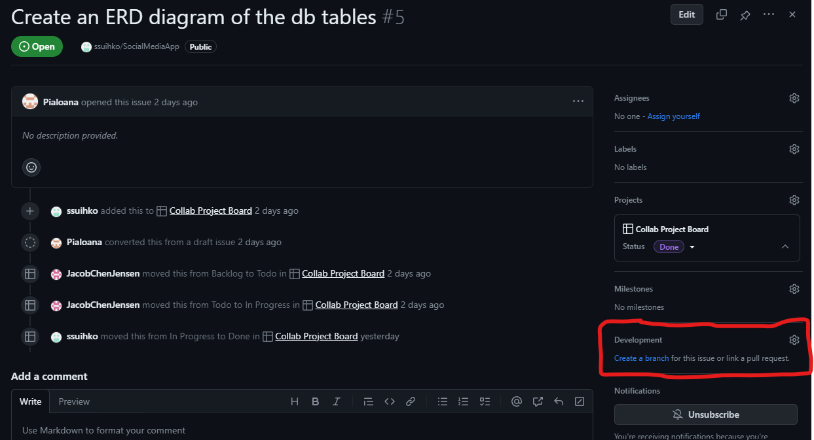
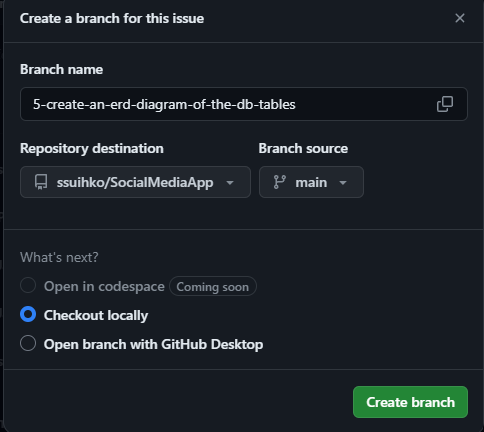

### How to contribute code

In the projects board

1. create an issue out of the task you've been assinged to.
   Make sure you pick the right project when creating the issue (SocialMediaApp).
2. Make a new branch from the issue view:

3. Make sure you create the new branch out of the main branch

4. You get a set of commands after clicking the 'create branch' button which look like this:

> git fetch origin
> git checkout 'branch-name'

Inside you local development terminal, make sure you are in the 'main' branch.
You can check this by runnin the command 'git branch -a'.
Copypaste the given commands to terminal inside of the correct project folder and press enter.

By running 'git branch -a' you will now see that you're inside of a new branch.

5. Make your new changes inside of this branch. Add, commit and push to this branch:

git add .
git commit -m "my comment"
git push -u origin 'my-branch-name'
