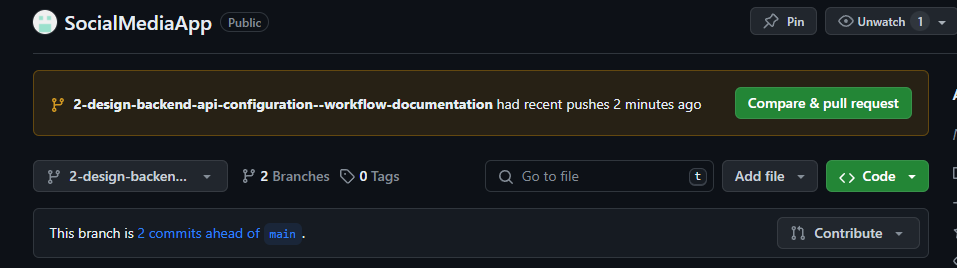

## How to contribute code

Taken from this recording:
https://us02web.zoom.us/rec/share/4fttR9QLqzxY18ptg_8kZv7nBGXFD-5vMpo80mvIuMraMlGpV0FsUagVxoltw1Hp.3c61x-tK3H9rweEn

If something in the instructions is not working, please checkout the video above.

In the projects board

## Create a branch for every new issue

1. create an issue out of the task you've been assinged to.
   Make sure you pick the right project when creating the issue (SocialMediaApp).
2. Make a new branch from the issue view:


3. Make sure you create the new branch out of the main branch


## Make commits and changes on the branch

4. You get a set of commands after clicking the 'create branch' button which look like this:

```console
git fetch origin
git checkout 'branch-name'
```

Inside you local development terminal, make sure you are in the 'main' branch.
You can check this by runnin the command 'git branch -a'.
Copypaste the given commands to terminal inside of the correct project folder and press enter.

By running 'git branch -a' you will now see that you're inside of a new branch.

5. Make your new changes inside of this branch. Add, commit and push to this branch:

```console
git add .
git commit -m "my comment"
git push -u origin 'my-branch-name'
```

6. Navigate to your branch in the repositry. In case your updates are recent, you should see a similar message:



## How to handle PRs

1. checkout main
2. pull latest changes from main
3. checkout the branch with your work that needs to be PRed
4. run git merge main which will pull latest changes from main into your branch
   if you get a GIT error for CONFLICT -> proceed with handling the conflict and choosing the right code to keep -> use your team to ensure you don't throw away valid code
5. build / run / test your code again to ensure any changes from main have not broken your features
6. repeat steps 2 -> 6 until all conflicts are resolved and your code works as intended
7. push up and create a PR

### MERGE CONFLICT ENCOUTERED

In terminal in the main branch:

```console
git fetch
git pull
```

Navigate to the branch where your changes are:

```console
git checkout -b 'your-branch-name'
git merge main
```

You will see a merge conflict is created. Fix the merge conflict in your code editor, and add + commit + push to the branch. Now you should be able to merge.
